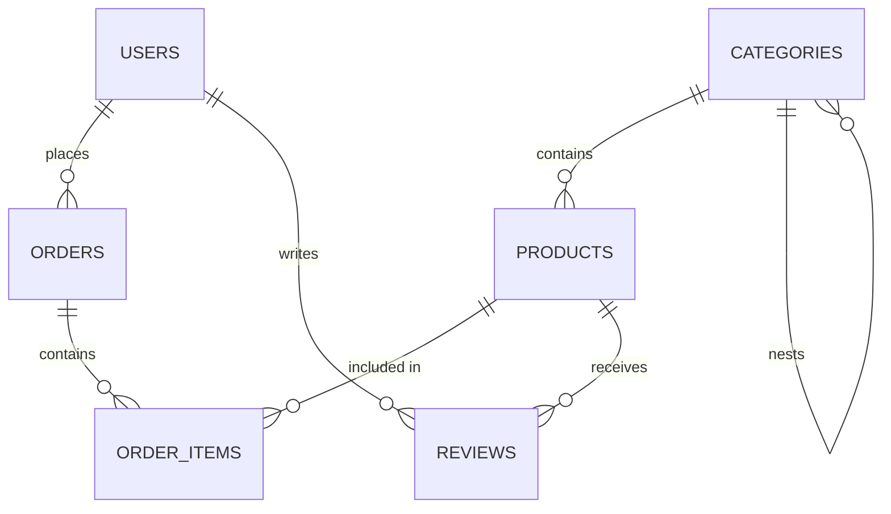

# PulseTrade E-commerce Project Plan

Welcome to the **PulseTrade** e-commerce project plan! This document details the architectural decisions, design choices, database schema, and a detailed implementation roadmap for all remaining work.

---

## 🚀 1. Tech Stack & Architecture

- **Backend Framework:** Laravel 11 (PHP 8.2+)
- **Database System:** MySQL
- **Frontend Stack:** Laravel Blade templates + Tailwind CSS + AlpineJS (for rich micro-interactions and smooth UI states)
- **Administration Panel:** Custom Admin Panel (sleek, premium dark mode, built with Blade and Tailwind CSS — no third-party admin package)
- **Asset Bundling:** Vite
- **Cart Storage:** Session-backed (no `carts` table — cart lives in the session as an array of `product_id => quantity`)

---

## 🎨 2. Design System & Aesthetics

PulseTrade is a **premium, high-end electronics and gadget store**. The design prioritizes visual excellence:
- **Color Palette:** Dark-blue-based brand palette — deep navy (slate/blue-900 base, e.g. `#0A1128`–`#0F1C3F`) paired with crisp white for contrast, text, and card surfaces. Accent tones stay within the blue family (mid-blue, sky-blue highlights) rather than indigo/purple/cyan.
- **Brand Colors:** Dark blue (primary) + White (secondary/contrast) — used consistently across logo, buttons, links, and the admin panel.
- **Typography:** Modern sans-serif (e.g., *Inter* or *Outfit* via Google Fonts).
- **Styling Details:** Smooth gradients, subtle border glows, card hover scaling, crisp glassmorphism panels.
- **Visual Assets:** Curated high-quality, professional mockups and product images.
- **Admin Panel:** Sidebar and header use a dark blue shade (matching brand navy) with white text/icons; main content area on a light/white background for readability of data tables. Denser layout optimized for management tasks rather than marketing.

---

## 📊 3. Database Schema (MySQL) — ✅ Already Built



### Table Details

1. **`users`** — `id`, `name`, `email`, `password`, `role` (`admin`|`customer`), `phone`, `address`, timestamps.
2. **`categories`** — `id`, `name`, `slug`, `description` (nullable), `parent_id` (self-referential FK), timestamps.
3. **`products`** — `id`, `category_id` (FK), `name`, `slug`, `description`, `price`, `sale_price` (nullable), `stock`, `image`, `images` (JSON array of gallery paths), `is_featured` (bool), timestamps.
4. **`orders`** — `id`, `user_id` (FK), `order_number` (unique), `status` (`pending|processing|shipped|completed|cancelled`), `total_amount`, `shipping_address`, `shipping_phone`, `payment_method` (`cod|stripe`), `payment_status` (`pending|paid|failed`), timestamps.
5. **`order_items`** — `id`, `order_id` (FK), `product_id` (FK), `quantity`, `price`, timestamps.
6. **`reviews`** — `id`, `user_id` (FK), `product_id` (FK), `rating` (1–5), `comment` (nullable), timestamps.

All Eloquent models (`User`, `Category`, `Product`, `Order`, `OrderItem`, `Review`) and their relationships are already implemented in `app/Models`.

---

## 🔐 4. Authorization & Middleware

- **`role` column** on `users` already exists (`admin` | `customer`), with `User::isAdmin()` / `User::isCustomer()` helper methods already implemented.
- **New middleware:** `app/Http/Middleware/EnsureUserIsAdmin.php`
  - Checks `auth()->check() && auth()->user()->isAdmin()`, otherwise aborts `403`.
  - Register alias `'admin'` in `bootstrap/app.php` (`->withMiddleware()` → `$middleware->alias(['admin' => EnsureUserIsAdmin::class])`).
- **Route protection:**
  - All `/admin/*` routes wrapped in `Route::middleware(['auth', 'verified', 'admin'])->prefix('admin')->name('admin.')->group(...)`.
  - Customer account routes (`/account/*`) wrapped in `['auth', 'verified']` only.
- **Policies (optional but recommended for reviews):**
  - `ReviewPolicy` — `update`/`delete` only allowed if `review.user_id === auth()->id()`.
  - Register in `AppServiceProvider` or via model discovery.
- **Seeder update:** `DatabaseSeeder` should create one admin user (`role = admin`) and a few customer users so the admin middleware is testable immediately after `php artisan migrate --seed`.

---

## 🛠️ 5. Admin Panel (Resource Controllers per Module)

Each domain gets its **own resource controller** (no monolithic `AdminController`), all under the `App\Http\Controllers\Admin` namespace and `admin.*` route names/views.

### 5.1 Dashboard
- **Controller:** `Admin/DashboardController@index`
- **Route:** `GET /admin` → `admin.dashboard`
- **View:** `resources/views/admin/dashboard.blade.php`
- **Data:** total orders, total revenue (`sum(total_amount)` where `payment_status = paid`), total products, low-stock count (`stock < 5`), 5 most recent orders.

### 5.2 Categories — `Admin/CategoryController` (resource)
| Route | Method | Action | View |
|---|---|---|---|
| `admin/categories` | GET | `index` | `admin.categories.index` |
| `admin/categories/create` | GET | `create` | `admin.categories.create` |
| `admin/categories` | POST | `store` | — |
| `admin/categories/{category}/edit` | GET | `edit` | `admin.categories.edit` |
| `admin/categories/{category}` | PUT | `update` | — |
| `admin/categories/{category}` | DELETE | `destroy` | — |

- Form fields: `name` (auto-slug via `Str::slug()`), `description`, `parent_id` (select, excludes self and descendants).
- Validation: `name` required, `slug` unique (ignore self on update).
- Index shows nested tree (top-level categories with children indented).

### 5.3 Products — `Admin/ProductController` (resource)
| Route | Method | Action |
|---|---|---|
| `admin/products` | GET | `index` (paginated, searchable by name, filterable by category/stock) |
| `admin/products/create` | GET | `create` |
| `admin/products` | POST | `store` |
| `admin/products/{product}/edit` | GET | `edit` |
| `admin/products/{product}` | PUT | `update` |
| `admin/products/{product}` | DELETE | `destroy` |

- Form fields: `category_id` (select), `name` (auto-slug), `description`, `price`, `sale_price` (nullable, must be `< price`), `stock`, `image` (file upload → `storage/app/public/products`, stored path in `image`), `images[]` (multiple file upload → JSON array in `images`), `is_featured` (checkbox).
- Use `Storage::disk('public')->put(...)` and remember to run `php artisan storage:link`.
- Validation via a dedicated `StoreProductRequest` / `UpdateProductRequest` form request.

### 5.4 Orders — `Admin/OrderController`
| Route | Method | Action |
|---|---|---|
| `admin/orders` | GET | `index` (filterable by `status`, `payment_status`) |
| `admin/orders/{order}` | GET | `show` (order detail + items + customer info) |
| `admin/orders/{order}` | PATCH | `updateStatus` (change `status` / `payment_status` via dropdown, no full edit form) |

- No create/delete — orders are created by customers via checkout; admin only manages status.

### 5.5 Reviews (light moderation, optional stretch)
- `Admin/ReviewController@index` / `destroy` — list all reviews, allow deleting abusive/spam ones.

### 5.6 Admin Layout & Navigation
- New layout: `resources/views/layouts/admin.blade.php` — sidebar (Dashboard, Categories, Products, Orders, Reviews) + topbar with admin name/logout, both styled in the dark blue brand shade with white text/icons and a highlighted active-link state.
- Reuses existing Blade components (`x-input-label`, `x-text-input`, `x-primary-button`, etc.) restyled to the dark blue + white brand palette.

---

## 🛍️ 6. Storefront Features

### 6.1 Homepage — `HomeController@index` → `/` (12 sections)

Rendered as `resources/views/home.blade.php`, composed of 12 distinct Blade sections/partials (`resources/views/home/_*.blade.php`), each on the dark blue + white brand palette:

1. **Hero Banner** — full-width dark navy hero with white headline/subhead, premium copy, CTA button ("Shop Now" → `/shop`), optional background product mockup.
2. **Trust/USP Strip** — 4-icon row: Free Shipping, Secure Payment, Warranty, 24/7 Support (static content, white icons on navy or navy icons on white).
3. **Featured Categories Grid** — `Category::whereNull('parent_id')->take(6)->get()`, each as a card linking to `/shop?category={slug}`.
4. **Featured Products Carousel** — `Product::where('is_featured', true)->take(8)->get()`, Alpine-driven horizontal scroll/carousel.
5. **Best Sellers** — top products ordered by total `order_items.quantity` sold (`withSum` or a raw aggregate query), take 8.
6. **Mid-Page Promo Banner** — single large CTA banner (e.g. "Up to 30% Off Selected Gear") linking to a filtered `/shop` view; static content, dark blue background with white text and a light accent button.
7. **New Arrivals** — `Product::latest()->take(8)->get()`.
8. **Deal of the Day** — one highlighted discounted product (`Product::whereNotNull('sale_price')->inRandomOrder()->first()` or a manually flagged product) with a countdown-style badge (static or Alpine timer).
9. **Why Choose PulseTrade** — brand story / value-proposition section (3–4 short columns: Quality, Curated Selection, Fast Delivery, Expert Support).
10. **Customer Testimonials & Reviews** — pull top-rated `Review::with('user','product')->where('rating', 5)->take(3)->get()` as quote cards.
11. **Brand/Partner Logos Strip** — static row of partner/brand logos (grayscale on white, or white-on-navy) for social proof.
12. **Newsletter Signup** — email capture form (dark navy background, white input on the form, POST to a lightweight `NewsletterController@store` or mailto stub if out of scope) with a short incentive line (e.g. "Get 10% off your first order").

### 6.2 Shop Catalog — `ShopController@index` → `/shop`
- Query params: `q` (search on `name`/`description`), `category` (slug), `min_price`/`max_price`, `sort` (`price_asc|price_desc|newest`).
- Paginated grid (12/page) using `Product::query()` builder chained by request filters.
- Sidebar: category list with counts, price-range slider (Alpine-driven, submits on release).

### 6.3 Product Detail — `ProductController@show({product:slug})` → `/shop/{product:slug}`
- Route-model binding on `slug`.
- Multi-image gallery (main `image` + `images[]`) with Alpine click-to-zoom/swap.
- Stock badge: `In Stock` (>5) / `Low Stock` (1–5) / `Out of Stock` (0).
- Tabs: Description / Reviews (`averageRating()` already on model, list existing reviews, review form for authenticated users who purchased the product — check via `OrderItem` join).
- "Add to Cart" form (quantity stepper + submit to `cart.add`).

### 6.4 Shopping Cart — `CartController` (session-based, no DB table)
| Route | Method | Action |
|---|---|---|
| `/cart` | GET | `index` — view cart contents |
| `/cart/add/{product}` | POST | `add` — increments session cart `[product_id => qty]` |
| `/cart/update/{product}` | PATCH | `update` — set quantity |
| `/cart/remove/{product}` | DELETE | `remove` |

- Cart drawer/overlay component (`resources/views/components/cart-drawer.blade.php`) rendered on every page via a composer/shared view data (`cart.count`), Alpine-toggled.
- Subtotal computed server-side using `Product::final_price` (existing accessor) × quantity; also exposed to Alpine for live UI updates.
- Stock validation: cannot add/update quantity beyond `product.stock`.

### 6.5 Checkout & Payments — `CheckoutController`
| Route | Method | Action |
|---|---|---|
| `/checkout` | GET | `index` — shipping form pre-filled from `user.phone`/`user.address`, order summary |
| `/checkout` | POST | `store` — validates, creates `Order` + `OrderItem`s, decrements `product.stock`, clears session cart, redirects to confirmation |
| `/checkout/{order}/confirmation` | GET | `confirmation` — thank-you page with order number |

- **Payment simulation (per plan decision — no real gateway):**
  - `payment_method` select: `cod` (Cash on Delivery) or `card` (simulated).
  - If `card` selected, show a sleek dummy card-entry UI (number/expiry/CVC with client-side Luhn-style formatting via Alpine) — on submit, always mark `payment_status = paid` after a simulated 1–2s "processing" delay (`setTimeout` in Alpine) with no real charge or external API call.
  - If `cod` selected, `payment_status = pending`.
- Wrap order + order_items creation + stock decrement in `DB::transaction()`.
- `order_number` generated as `'PT-' . strtoupper(Str::random(8))`, unique-checked in a loop.

### 6.6 Customer Account Area — `Account/OrderController` (extends existing profile pages)
| Route | Method | Action |
|---|---|---|
| `/account/orders` | GET | `index` — paginated order history with status badges |
| `/account/orders/{order}` | GET | `show` — full order detail (only if `order.user_id === auth()->id()`, else 403) |

- Add "My Orders" link to existing `resources/views/layouts/navigation.blade.php` dropdown alongside Profile/Logout.
- Existing `profile.edit` page already covers name/email/password — extend its form to also edit `phone`/`address` (used as checkout defaults).

---

## 🗂️ 7. New Files Summary

```
app/Http/Middleware/EnsureUserIsAdmin.php
app/Http/Controllers/HomeController.php
app/Http/Controllers/ShopController.php
app/Http/Controllers/ProductController.php
app/Http/Controllers/CartController.php
app/Http/Controllers/CheckoutController.php
app/Http/Controllers/Account/OrderController.php
app/Http/Controllers/Admin/DashboardController.php
app/Http/Controllers/Admin/CategoryController.php
app/Http/Controllers/Admin/ProductController.php
app/Http/Controllers/Admin/OrderController.php
app/Http/Controllers/Admin/ReviewController.php
app/Http/Requests/StoreProductRequest.php
app/Http/Requests/UpdateProductRequest.php
app/Policies/ReviewPolicy.php

app/Http/Controllers/NewsletterController.php

resources/views/home.blade.php
resources/views/home/_hero.blade.php
resources/views/home/_trust-strip.blade.php
resources/views/home/_featured-categories.blade.php
resources/views/home/_featured-products.blade.php
resources/views/home/_best-sellers.blade.php
resources/views/home/_promo-banner.blade.php
resources/views/home/_new-arrivals.blade.php
resources/views/home/_deal-of-the-day.blade.php
resources/views/home/_why-choose-us.blade.php
resources/views/home/_testimonials.blade.php
resources/views/home/_brand-strip.blade.php
resources/views/home/_newsletter.blade.php
resources/views/shop/index.blade.php
resources/views/shop/show.blade.php
resources/views/cart/index.blade.php
resources/views/checkout/index.blade.php
resources/views/checkout/confirmation.blade.php
resources/views/account/orders/index.blade.php
resources/views/account/orders/show.blade.php
resources/views/components/cart-drawer.blade.php
resources/views/components/product-card.blade.php
resources/views/layouts/admin.blade.php
resources/views/admin/dashboard.blade.php
resources/views/admin/categories/{index,create,edit}.blade.php
resources/views/admin/products/{index,create,edit}.blade.php
resources/views/admin/orders/{index,show}.blade.php

routes/web.php        (extended with shop/cart/checkout/account/admin groups)
database/seeders/DatabaseSeeder.php   (extended: admin user + demo categories/products)
```

---

## 🛠️ 8. Development Roadmap

- [x] Scaffold Laravel Breeze & auth views
- [x] Create database migrations & models (categories, products, orders, order_items, reviews)
- [ ] **Phase 1 — Foundations:** switch `DB_CONNECTION` to `mysql` in `.env` (set `DB_HOST`, `DB_PORT`, `DB_DATABASE`, `DB_USERNAME`, `DB_PASSWORD`; project currently defaults to `sqlite`), re-run `php artisan migrate:fresh --seed`, `EnsureUserIsAdmin` middleware, admin route group, `admin.*` layout, updated seeder (admin user + demo data)
- [ ] **Phase 2 — Admin Panel:** Dashboard, Category CRUD, Product CRUD (with image upload), Order management (status updates)
- [ ] **Phase 3 — Storefront:** Homepage (12 sections: hero, trust strip, featured categories, featured products, best sellers, promo banner, new arrivals, deal of the day, why choose us, testimonials, brand strip, newsletter), Shop catalog (search/filter/sort), Product detail page with gallery + reviews
- [ ] **Phase 4 — Cart & Checkout:** Session cart + drawer, checkout flow, simulated payment, order confirmation
- [ ] **Phase 5 — Customer Account:** Order history + detail pages, extend profile form with phone/address
- [ ] **Phase 6 — Polish & Testing:** Feature tests for cart/checkout/admin authorization, empty states, responsive pass, seed realistic demo catalog with product images
